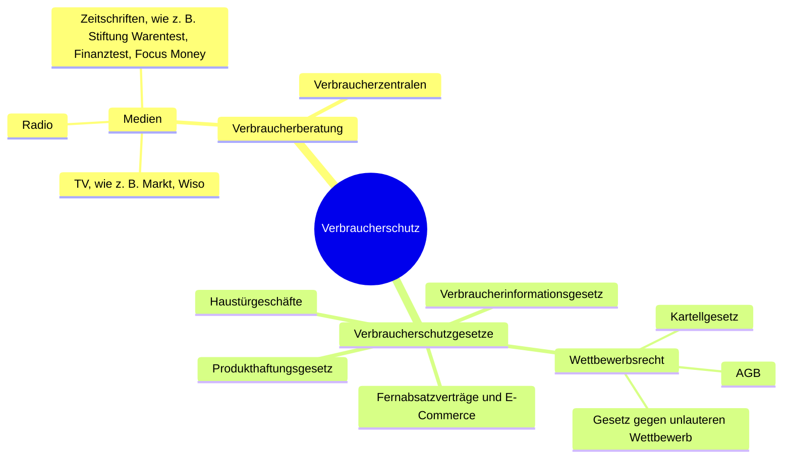

# Verbraucherschutz

```mermaid
mindmap
  root((Verbraucherschutz))
    Verbraucherberatung
      Verbraucherzentralen
      Medien
        TV, wie z. B. Markt, Wiso
        Radio
        Zeitschriften, wie z. B. Stiftung Warentest, Finanztest, Focus Money
    Verbraucherschutzgesetze
      Fernabsatzverträge und E-Commerce
      Produkthaftungsgesetz
      Verbraucherinformationsgesetz
      Wettbewerbsrecht
	      Gesetz gegen unlauteren Wettbewerb
	      Kartellgesetz
	      AGB
      Haustürgeschäfte
```
