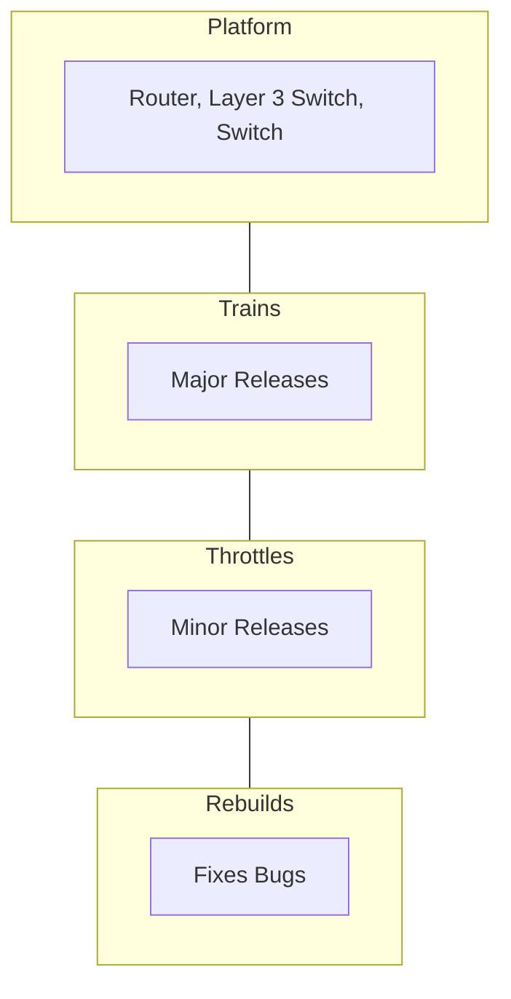

# Cisco Router

Ein Cisco Router besitzt drei Modi:

- User EXEC Mode (`Router>`)
- Privileged EXEC Mode (`Router#`)
- Global Configuration Mode (`Router(config)#`)

## Boot Prozess

### Vergleich zum herkömmlichen PC

| PC Boot Process        | Router Boot Process                           |
| ---------------------- | --------------------------------------------- |
| Power On Self Test     | Power On Self Test                            |
| Load BIOS from ROM     | Load Bootstrap (like BIOS on normal PC)       |
| Load Operating System  | Load IOS                                      |
| Load Personal Settings | Load Configuration (from startup-config file) |

### Boot Prozess unterbrechen

Die Unterbrechung des Boot Prozesses zum richtigen Zeitpunkt hat den Vorteil, dass man im  ROM Monitor Mode (Bootstraps CLI) stecken bleibt und Zugriff auf das Configuration Register bekommt.

#### Configuration Register

Das Configuration Register im ROMmon-Modus eines Cisco-Routers ist eine spezielle 16-Bit-Einstellung in Hexadezimalform, die das Verhalten des Routers beim Booten steuert. Es kann verwendet werden, um verschiedene Startoptionen zu konfigurieren.

Standard-Einstellung: `0x2102`  
In binär: `0010 0001 0000 0010`

Die letzten vier Bits sind Boot Fields. Wenn diese vier letzten Bits wie in der Standart-Einstellung genauso verbleiben, dann bedeutet es, dass so gebootet werden soll, wie es in der Startup-Config File drin steht.

Wenn man nun diese Bits manipuliert, kann man folgende Ergebnisse erzielen:

- `0000`: Bootet in den ROM Monitor Mode
- `0001`: Bootet erstes Boot-Image aus dem Flash Memory
- `0010` - `1111`: Prüft, ob in der Startup-Config ein Boot-Image angegeben ist. Wenn nicht, wird das erste Image im Flash gebootet.

Wenn das siebte Bit von rechts auf `0` steht, dann bedeutet das, dass der Inhalt des NVRAMs ausgelesen wird und die Startup-Config geladen wird. Es wird die Startup-Config File in die Running-Config File kopiert.

Falls das siebte Bit auf `1` gesetzt wird, dann heißt es, dass die Startup-Config nicht geladen wird.

## Internetworking Operating System (IOS)

Cisco IOS (Internetwork Operating System) ist das proprietäre Betriebssystem von Cisco für Router und Switches und wird im Flash Memory gespeichert (nicht RAM oder NVRAM!). An folgende Versionsstruktur hält sich Cisco:



- Router, Switches und Layer 3 Switches enthalten die `Model Number`
- Format von Major Releases: `12.2` - `12.4` - `15.0` - `15.1`
- Format von Minor Releases: `12.2(10)` - `12.4(20)` - `15.0(1)` - `15.1(3)`
- Format von Rebuilds: `12.2(10b)` - `12.4(20)T3` - `15.0(1)M8` - `15.1(3)T2`

### Vorteile eines IOS-Upgrades

Wenn man ein Feature Set hat, wie z. B. das ipbase-image, und man benötigt dann auch IPv6-Funktionen, dann kann man mithilfe einem kostenpflichtigen licence key sein Image auf diese benötigen Funktionen upgraden.

### File-Naming

#### Beispiel 1

`c1841-adventerprisek9-mz.124-24.T5.bin`

-> c1841: Cisco 1800 Series router model 1841  
-> adventerprisek9-mz: Advanced Enterprise Feature Set  
-> 124: Train  
-> 24: Throttle  
-> T5: Rebuild  
-> .bin: Binary File System

#### Beispiel 2

`c1900-universalk9-mz.SPA.153-3.M4.bin`

-> c1900: All 1900 Series Routers  
-> universalk9-mz.SPA: Universal Feature Set    
-> 153: Train  
-> 3: Throttle  
-> M4: Rebuild  
-> .bin: Binary File System

!!! info
	`k9` im Feature Set ermöglicht kryptographische Funktionen wie SSH und VPN.

## Konfiguration

### Hostnamen vergeben

```cli
enable
configure terminal

hostname <YourHostname>
```

### Banner erstellen

```cli
enable
configure terminal

banner motd # <YourBanner> #
```

### Zugriff mit Passwörtern absichern

#### Konsolen- und AUX-Port

```cli
enable
configure terminal

! Sets a password for console access
line console 0
password <YourPassword>
login

! Sets a password for auxiliary (remote) access
line aux 0
password <YourPassword>
login
exit

! Prevents passwords from being displayed in plain text in the running-config
service password-encryption
```

#### Privileged EXEC Mode

```cli
enable
configure terminal

enable secret <YourPassword>
```

### Änderungen absichern

Der folgende Befehl speichert alle Änderungen, welche bisher im RAM (flüchtiger Speicher) vorgenommen wurden, in den NVRAM (nicht flüchtiger Speicher), wenn man sich im Privileged EXEC Mode befindet:

```cli
copy running-config startup-config
```

### SSH aktivieren

Um SSH zu konfigurieren, kann man das mit folgender Methode machen:

```cli
enable
configure terminal

! SSH needs a domain-name
ip domain-name unykad.com

! Generates an RSA key for secure SSH acces and sets up a user login
crypto key generate rsa general-keys
<KeySize, e.g. 1024>
ip ssh version 2
username <YourUsername> secret <YourPassword>

! Allows up to 5 simultaneous connections, restricted to SSH only
line vty 0 4
transport input ssh

! Uses locally configured usernames for authentication instead of a simple password
login local

! Synchronizes log messages with user input to prevent interruptions while typing
logging synchronous
```

!!! info
	Um SSH verwenden zu können, muss man IP-Adressen auf den Interfaces konfigurieren.

Mit dem folgenden Befehl kann man sich via SSH mit dem Router verbinden (Passwort wird nach Eingabe des Befehls abgefragt):

```shell
ssh -l <YourUsername> <GatewayIP>
```

#### Syslog- und Debug-Meldungen anzeigen

Wenn man sich über SSH mit dem Router verbindet, dann ist es standartmäßig so, dass man keine gewohnte Anzeige von die Syslog- und Debug-Meldungen erhält, wie man das von der Verbindung über das Konsolenkabel, gewohnt ist. Diese Anzeige kann man mit folgendem Befehl im Privileged EXEC Mode aktivieren:

```cli
terminal monitor
```

### IPv4-Adressen einrichten

```cli
enable
configure terminal

! Sets IP address and subnet mask for an interface
interface <InterfaceName>
ip address <IP address> <subnet mask>

! Activates the port
no shutdown
```

### IPv6-Adressen einrichten

```cli
enable
configure terminal

ipv6 unicast-routing
interface <InterfaceName>
ipv6 address <IPv6 address>
```

### IOS-Upgrade

Man kann ein IOS-Upgrade auf verschiede Weisen ausführen. Einer dieser Methoden benötigt:

- Rollover- und Ethernetkabel zwischen dem Router und dem PC
- TFTP Server (z. B. http://tftpd32.jounin.net)

Version des Routers anzeigen:

```cli
show version
```

Flash Speicher des Routers aufrufen:

```cli
show flash
```

Falls man nicht genug Speicher hat, um zwei IOS-Betriebssysteme im Flash Memory zu speichern (altes als Backup), dann gibt es die Option das alte Betriebssystem zu deinstallieren:

```cli
delete flash:/<NameOfIOS>
```

Nach dem Installieren des TFTP-Servers, welcher auf UDP basiert, sollte man Current Directory auf den Pfad setzen, wo sich die neue ISO befindet. Danach kopiert man diese Datei aus dem lokalen PC auf den Router:

```cli
copy tftp flash
<TFTP-ServerIP>
<New IOS-Name>
! press return key
```

In das neue Betriebssystem reinbooten:

```cli
enable
configure terminal

boot system flash:/<New IOS-Name>
exit
copy running-config startup-config

! press return key

! Restarts the router to apply changes
reload
```

### Konfigurationen auf dem Router zurücksetzen

Um den Router komplett zurückzusetzen, benutzt man folgenden Befehl:

```cli
enable 

! Deletes all stored configurations from NVRAM
erase startup-config

reload
```
