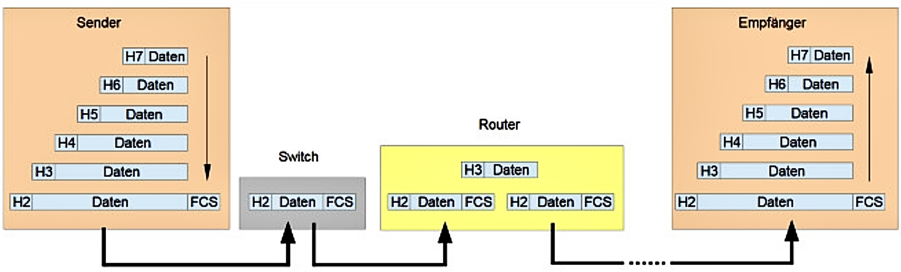

# Ethernet-Frame

## Aufbau

| <!-- -->      | <!-- -->                    | <!-- -->                | <!-- -->           | <!-- -->      | <!-- -->        | <!-- -->                   |
|:-------------:|:---------------------------:|:-----------------------:|:------------------:|:-------------:|:---------------:|:--------------------------:|
| Preamble      | Start Frame Delimiter (SFD) | Destination MAC address | Source MAC address | Type          | User Data       | Frame Check Sequence (FCS) |
| 7 Byte        | 1 Byte                      | 6 Byte                  | 6 Byte             | 2 Byte        | 46 - 1500 Byte  | 4 Byte                     |

Wireshark zeigt nur die Felder von "Destination MAC address" bis "User Data" an.  
Ein Ethernet-Frame muss standardmäßig mindestens 64 Byte groß sein, damit die Kollisionserkennung funktioniert, und kann maximal 1.518 Byte groß sein.

### Funktion

#### Preamble

Die Präambel (englisch: Preamble) in einem Ethernet-Frame ist immer gleich und dient der Taktsynchronisation zwischen dem Sender und dem Empfänger.  
10101010 10101010 10101010 10101010 10101010 10101010 10101010

#### Start Frame Delimitter (SFD)

Die SFD folgt direkt auf die Präambel. Sie ist im Ethernet-Frame immer gleich und markiert den eigentlichen Beginn des Frames.  
10101011

#### Destination MAC

Die Destination MAC ist die Adresse des Ziels.

#### Source MAC

Die Source MAC ist die Adresse des Absenders.

#### Type

Der Type beschreibt an welches Schicht 3 Protokoll die Daten beim Auspacken übergeben werden.  
Bsp.:  
0x0800 -> IPv4  
0x0806 -> ARP  
0x86dd -> IPv6

#### Data

Die Daten (Englisch: Data) bestehen einmal aus dem Header der höheren Schichten sowie der Nutzdaten.

#### Frame Check Sequence (FCS)

Die Blockprüfzeichenfolge (BPF)(englisch: Frame Check Sequence (FCS)) ermöglicht eine Fehlererkennung und eine Fehlerkorrektur auf dem Ethernet-Frame.
