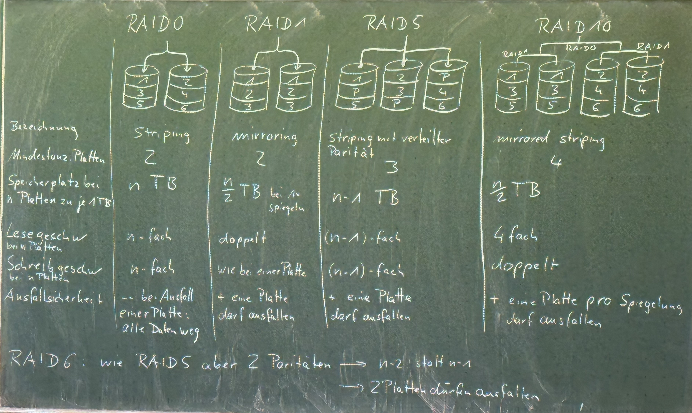

# RAID – Redundant Array of Independent Disks

**Festplatten (SSDs)** werden im Verbund zusammengeschaltet,  
um höhere Geschwindigkeit und höhere Ausfallsicherheit zu erhalten.

---

## JBOD – Just a Bunch of Disks

> Einfach mehrere Platten im Rechner – **ohne RAID**.

---

## Hardware RAID

- **Spezielle Hardware (RAID-Controller)** übernimmt das Management des RAID-Systems  
  → z. B. PCIe-Karte

- **Hardware RAID auf dem Mainboard**:  
  Fehleranfällig, keine gute Lösung

---

## Software RAID

- Das **Betriebssystem** übernimmt das RAID.  
- Vorteil: Bei Ausfall muss nur das Betriebssystem repariert werden.  
- **Nachteil**: CPU wird belastet.

---

## Begriffe

- **Hot Swap, Hot Plug**:  
  Platte kann im laufenden Betrieb getauscht werden

- **Hot Fix Platte, Hot Spare Platte**:  
    - Platte läuft leer im System mit  
    - Wenn eine Platte ausfällt, werden deren Daten auf die Hot-Fix-Platte überspielt

---

