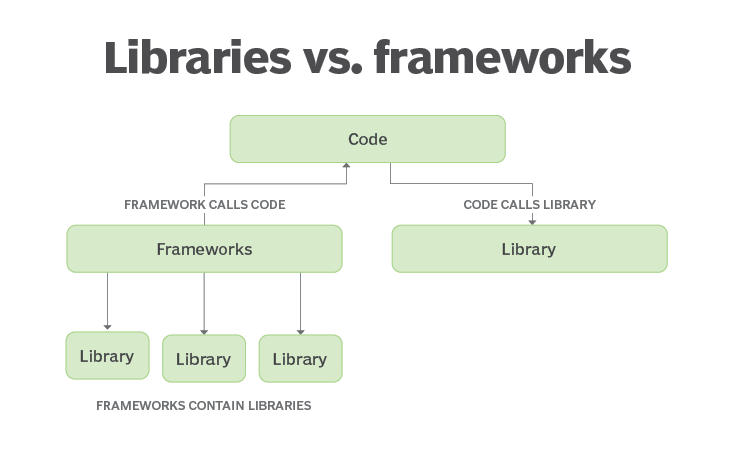

# Libraries vs frameworks

## Die wichtigsten Unterschiede

Eine Library unterstützt dich, während ein Framework dich durch feste Regeln und Strukturen leitet.

### Steuerung

Library: Du rufst die Funktionen der Library auf (du bist der Chef).  
Framework: Das Framework ruft deinen Code auf (es ist der Chef).

### Komplexität

Library: Einfach zu integrieren, fokussiert auf spezifische Aufgaben.  
Framework: Eignet sich besser für große Projekte mit komplexeren Anforderungen.

### Flexibilität

Library: Hohe Flexibilität, da du den Aufbau deines Codes kontrollierst.
Framework: Weniger flexibel, aber klarer Rahmen für eine konsistente Codebasis.
