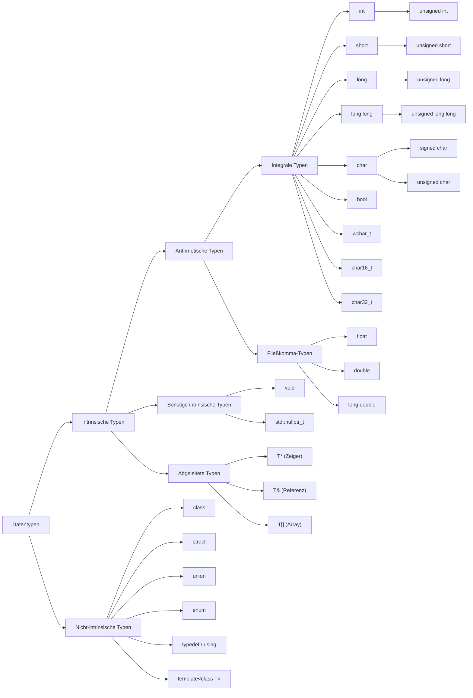

# Datentypen

## Intrinsische (primitive) Datentypen

Typen, die vom Compiler eingebaut sind und zur Sprache selbst gehören:

| **Datentyp**          | **Beschreibung**                            | **Speichergröße**               |
|-----------------------|---------------------------------------------|---------------------------------|
| `int`                 | Ganze Zahlen                                | 4 Bytes                         |
| `short`               | Kleine ganze Zahlen                         | 2 Bytes                         |
| `long`                | Große ganze Zahlen                          | 4 oder 8 Bytes*                 |
| `long long`           | Sehr große ganze Zahlen                     | 8 Bytes                         |
| `unsigned int`        | Ganze Zahlen ohne Vorzeichen                | 4 Bytes                         |
| `unsigned short`      | Kleine ganze Zahlen ohne Vorzeichen         | 2 Bytes                         |
| `unsigned long`       | Große ganze Zahlen ohne Vorzeichen          | 4 oder 8 Bytes*                 |
| `unsigned long long`  | Sehr große ganze Zahlen ohne Vorzeichen     | 8 Bytes                         |
| `char`                | Einzelne Zeichen (signed oder unsigned)     | 1 Byte                          |
| `signed char`         | Zeichen mit Vorzeichen (–128 bis 127)       | 1 Byte                          |
| `unsigned char`       | Zeichen ohne Vorzeichen (0 bis 255)         | 1 Byte                          |
| `bool`                | Wahrheitswerte (`true` / `false`)           | 1 Byte                          |
| `wchar_t`             | Breitere Zeichen (plattformabhängig)        | 2 oder 4 Bytes*                 |
| `char16_t`            | UTF-16 Zeichen                              | 2 Bytes                         |
| `char32_t`            | UTF-32 Zeichen                              | 4 Bytes                         |
| `float`               | Gleitkommazahl (einfache Genauigkeit)       | 4 Bytes                         |
| `double`              | Gleitkommazahl (doppelte Genauigkeit)       | 8 Bytes                         |
| `long double`         | Präzisere Gleitkommazahl                    | 8, 12 oder 16 Bytes*            |
| `void`                | Kein Wert                                   | Keine Speichergröße             |
| `std::nullptr_t`      | Typ von `nullptr`                           | Wie ein Zeiger (4 oder 8 Bytes) |
| `T*`                  | Zeiger auf beliebigen Typ                   | 4 oder 8 Bytes*                 |
| `T&`                  | Referenz auf einen Typ                      | Wie Zieltyp (Referenzmodell)    |
| `T[]`                 | Array eines Typs                            | Abhängig von der Länge          |

---

## Nicht-intrinsische (abgeleitete) Datentypen

Typen, die du selbst definierst:

| **Datentyp**         | **Beschreibung**                              | **Speichergröße**                     |
|----------------------|-----------------------------------------------|---------------------------------------|
| `class`              | Benutzerdefinierte Klasse                     | Abhängig von enthaltenen Mitgliedern  |
| `struct`             | Struktur (ähnlich wie `class`, aber `public`) | Abhängig von enthaltenen Feldern      |
| `union`              | Speicher für mehrere Typen (nur einer aktiv)  | Größe des größten Elements            |
| `enum`               | Aufzählung fester benannter Konstanten        | Typabhängig, oft wie `int` (4 Bytes)  |
| `typedef` / `using`  | Alias für bestehenden Typ                     | Wie Zieltyp                           |
| `template<class T>`  | Generischer Typ, bei Benutzung konkretisiert  | Wie spezifizierter Zieltyp            |

---

**Hinweise:**  
- Speichergrößen mit einem Sternchen (`*`) können je nach **Systemarchitektur** variieren:  
  - **32-Bit-Systeme**: Hier sind Speichergrößen oft kleiner, z. B. `long` = 4 Bytes, Zeiger = 4 Bytes.  
  - **64-Bit-Systeme**: Hier sind Speichergrößen größer, z. B. `long` = 8 Bytes, Zeiger = 8 Bytes.  
- Die Größe von `long double` kann ebenfalls je nach Compiler und Plattform variieren (z. B. 8, 12 oder 16 Bytes).
