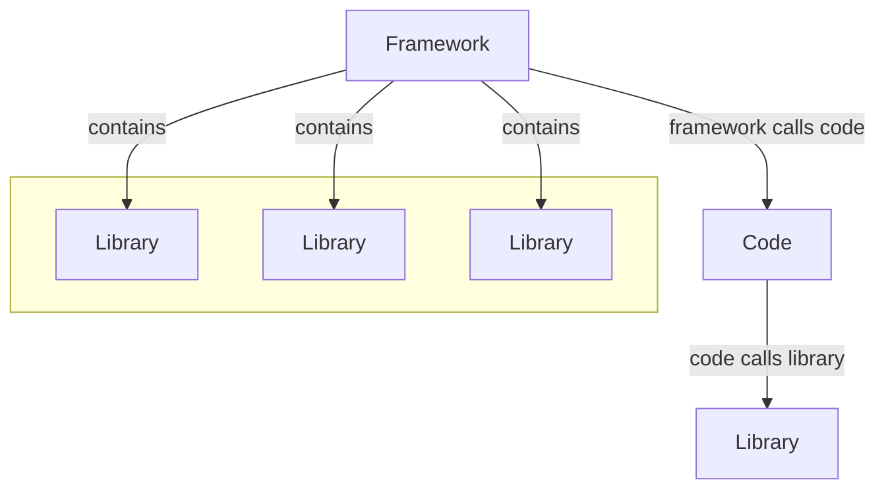

# Libraries and Frameworks

## Key Differences

A library supports you, while a framework guides you through fixed rules and structures.

### Control

Library: You call the functions of the library (you are in control).  
Framework: The framework calls your code (it is in control).

### Complexity

Library: Easy to integrate, focused on specific tasks.  
Framework: Better suited for large projects with more complex requirements.

### Flexibility

Library: High flexibility since you control the structure of your code.  
Framework: Less flexible but provides a clear structure for a consistent codebase.
